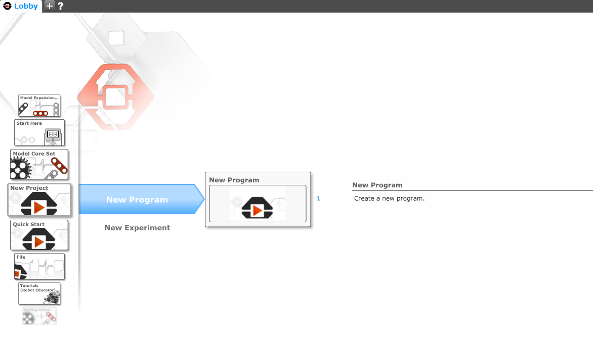
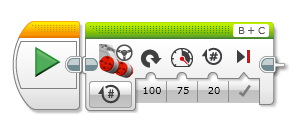
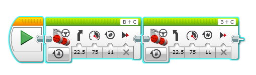
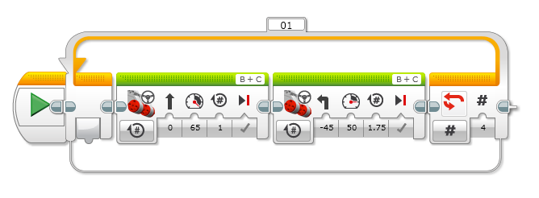
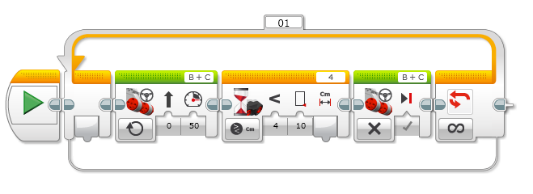
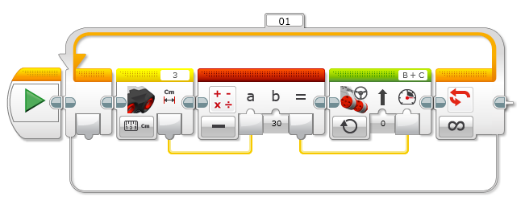
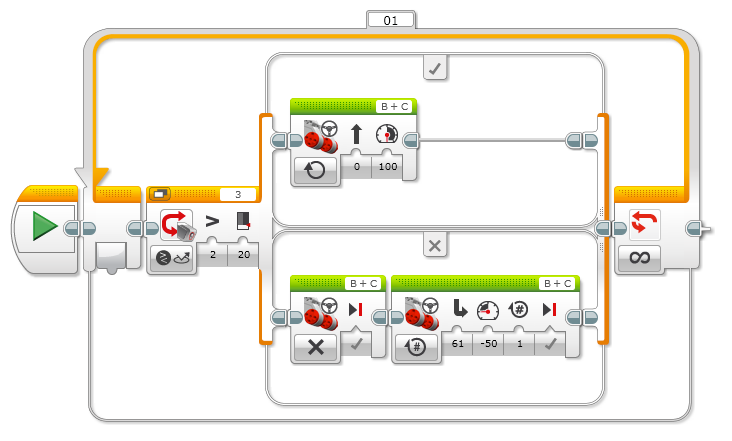
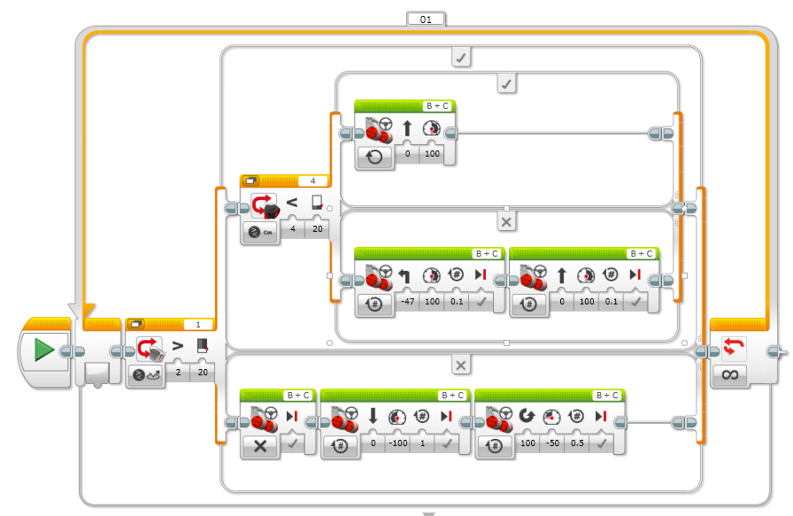

# **Lego Minstorm Coding Instructions**

[TOC]

## 1. Setup
1. Download the appropriate Lego Mindstorm software from this website and install it:  https://www.lego.com/en-au/themes/mindstorms/downloadsor 
2. In the lobby goto New Project,   New Program
3. Below are all the instructions, the code can however be downloaded from this website: https://github.com/JnrEng/ev3-webinar/blob/master/Ev3MindstormsJnr.ev3

## 2. Drive Straight

   

## 3. Drive Circle

   

## 4. Drive Figure 8

   

## 5. Drive Square

   

## 6. Drive until obstacle is detected by Ultra Sonic

   

## 7. Use the Force(Ultra Sonic)

   

## 8. Drive until black line is detected

   

## 9. Sumo Bot

   

